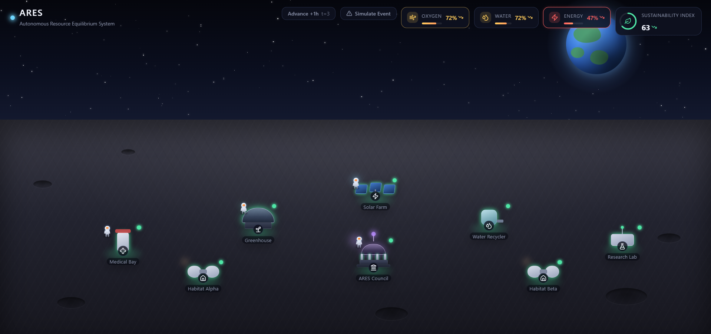
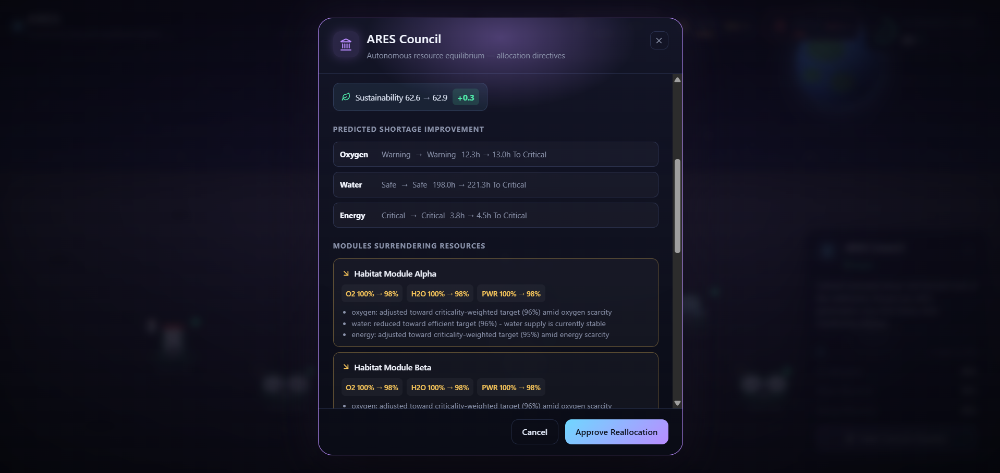
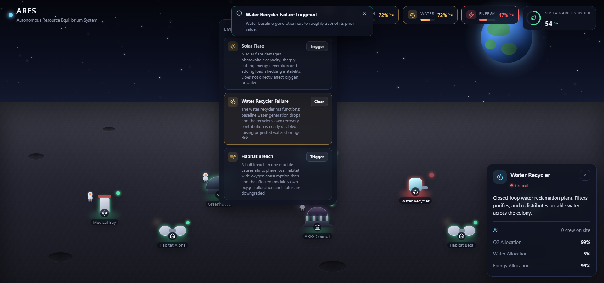

# 🌕 ARES — Autonomous Resource Equilibrium System

ARES is an AI-assisted lunar habitat management platform designed to simulate, monitor, predict, and optimize critical life-support resources in a space habitat.

Built for a hackathon, ARES demonstrates how autonomous decision-support systems can improve the sustainability and resilience of future lunar colonies through real-time simulation, predictive analytics, and emergency response.

---

## 🚀 Features

- 🌍 Interactive Lunar Habitat Dashboard
- 📊 Real-Time Resource Simulation
- 📈 AI-Based Resource Shortage Prediction
- ⚡ Autonomous Resource Optimization
- 🚨 Emergency Scenario Simulation
- 🌱 Sustainability Index Monitoring
- 🔄 Dynamic Resource Allocation
- 🛰️ Modular FastAPI + React Architecture

---

## 🖥️ Tech Stack

### Frontend
- React
- Vite
- CSS

### Backend
- FastAPI
- Python
- Pydantic

### Core Systems
- Habitat Simulation Engine
- Prediction Engine
- Optimization Engine
- Emergency Scenario Engine
- Sustainability Analysis

---

## 📂 Project Structure

```
ARES
├── backend
│   ├── app
│   └── requirements.txt
│
├── frontend
│   ├── src
│   └── package.json
│
├── README.md
└── SETUP.md
```

---

## 📸 Screenshots

### Dashboard


---

### Resource Simulation



---

### Optimization Engine



---

### Emergency Scenario Simulation



---

## ⚙️ Setup

Complete setup and deployment instructions are available in:

**➡️ SETUP.md**

---

## 🎯 Problem Statement

Develop an intelligent system capable of autonomously managing resources inside a lunar habitat by monitoring habitat health, predicting future shortages, optimizing resource allocation, and responding to emergency situations.

---

## 💡 Solution

ARES combines real-time simulation with AI-assisted decision support to help operators monitor habitat conditions, forecast critical shortages, optimize available resources, and simulate emergency scenarios within a unified interactive dashboard.

---

## 👥 Team

- Devansh Tiwari
- Ayush Pandey

---

## 📄 License

This project was developed as part of a hackathon and is intended for educational and demonstration purposes.

---

⭐ If you found this project interesting, consider giving it a star!
